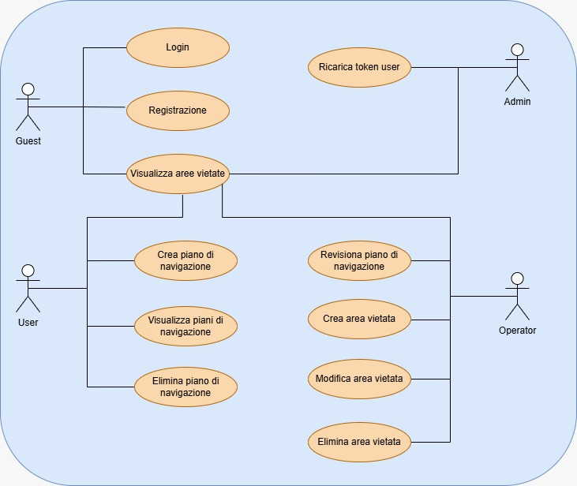
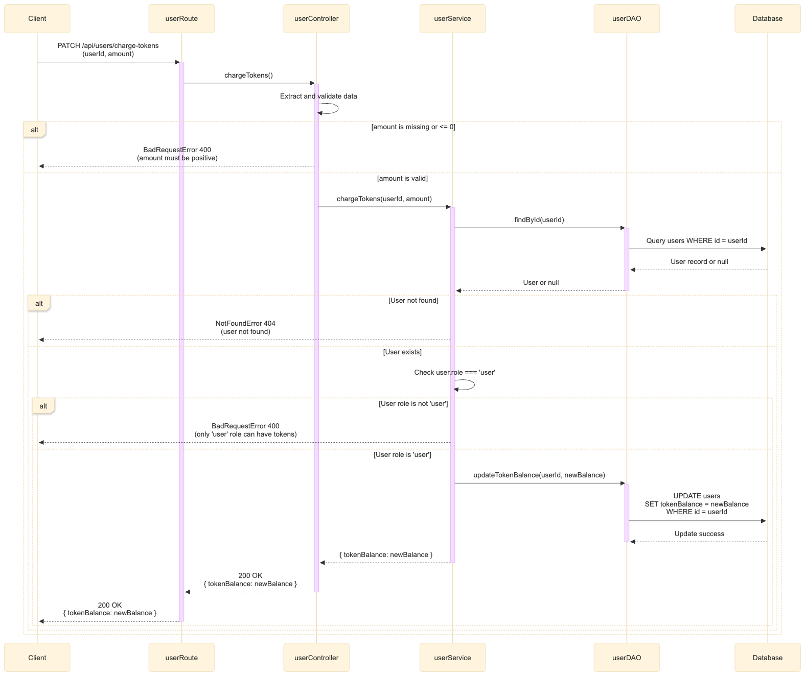
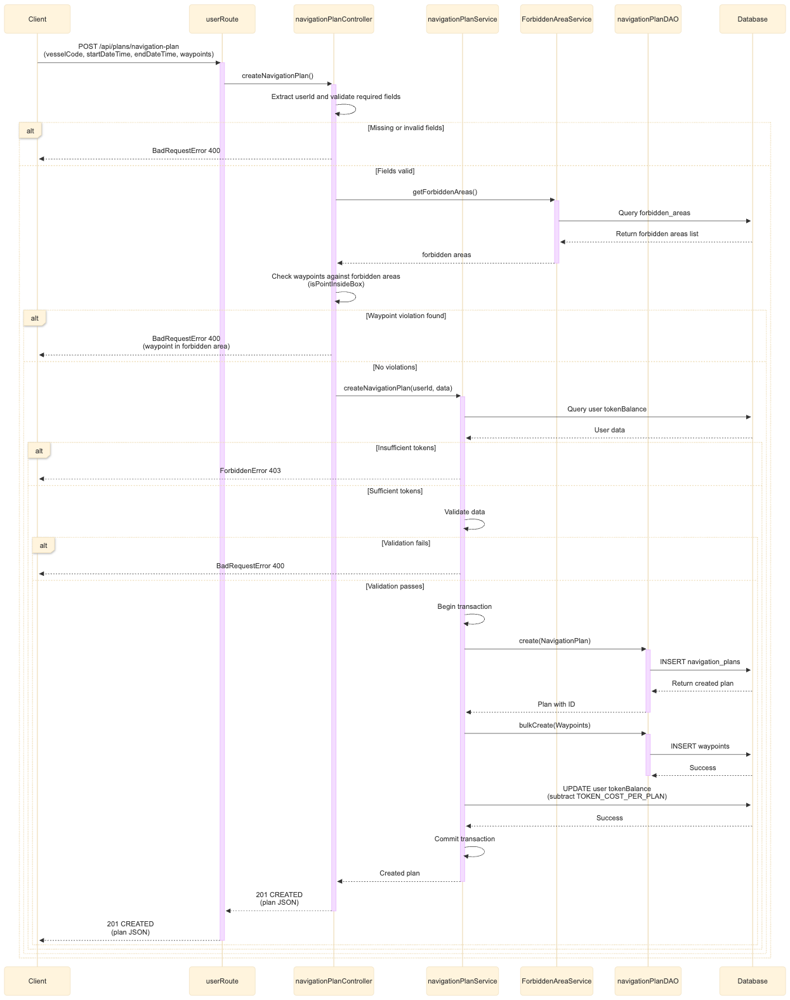
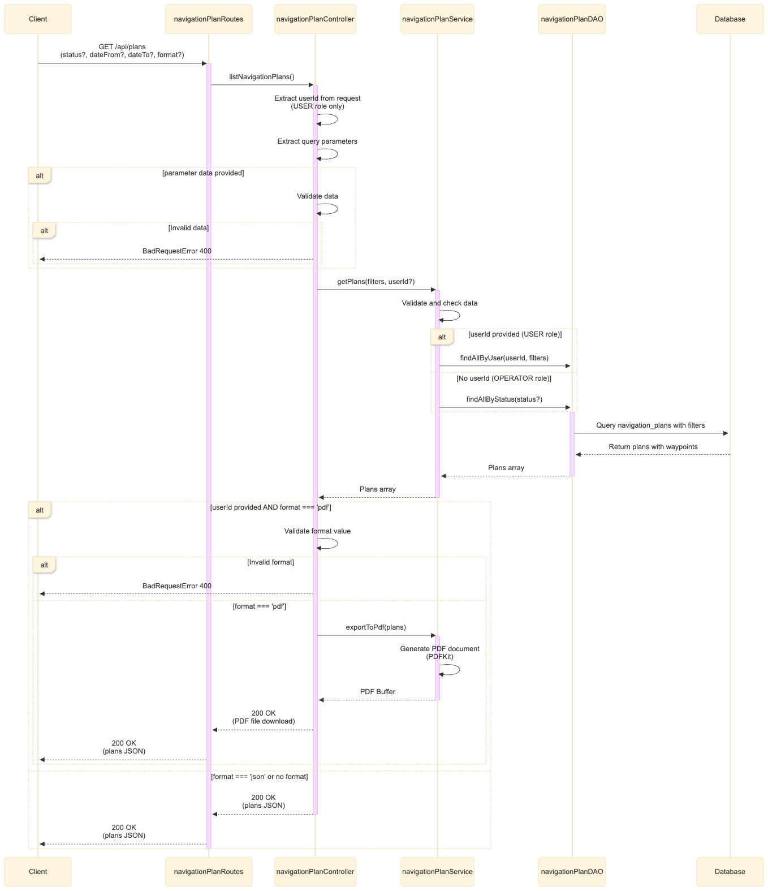
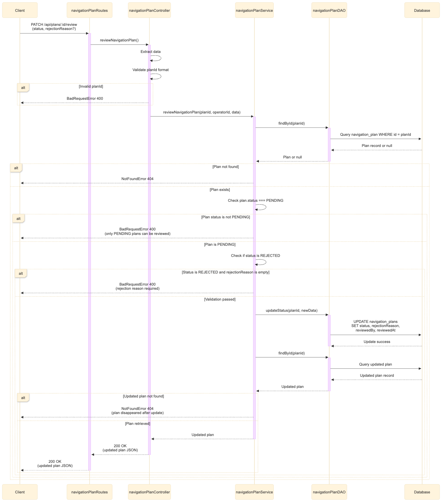
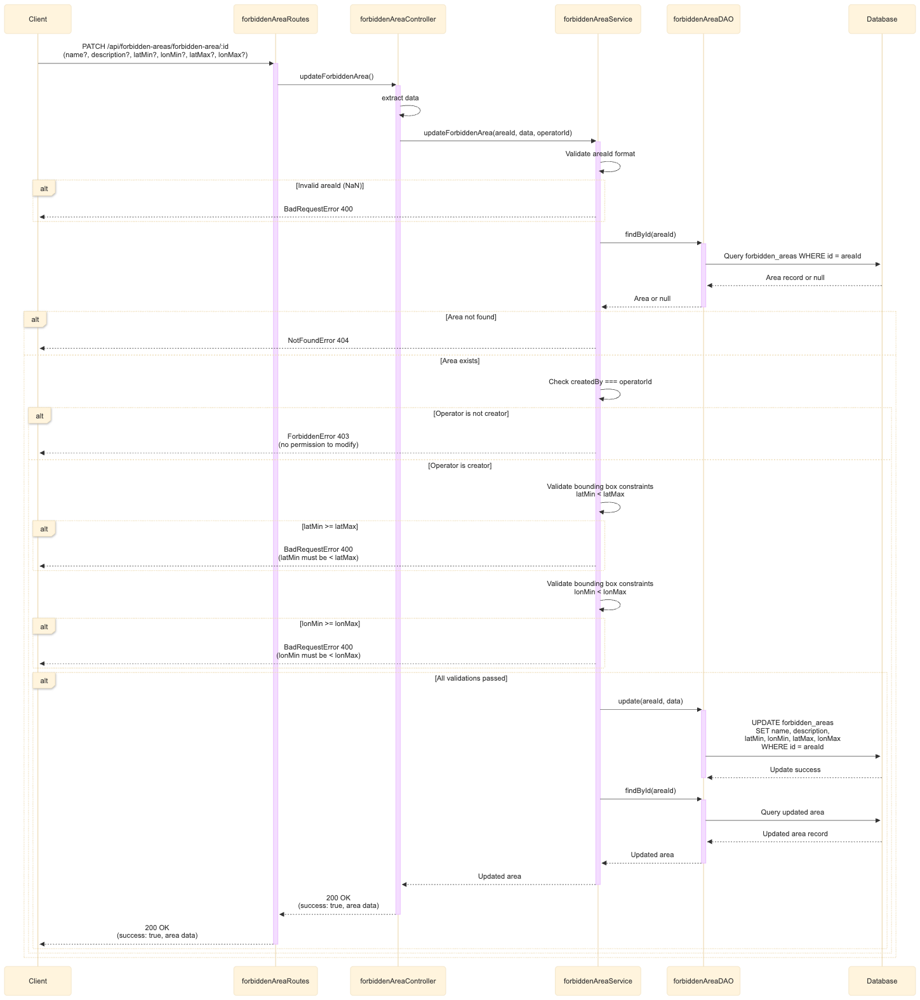

# Drone-Backend-PA

Il sistema gestisce i piani di navigazione di droni marini autonomi attraverso un flusso di approvazione strutturato. Gli utenti sottomettono richieste di navigazione specificando l'imbarcazione, le date di inizio e fine e la rotta composta da una serie di waypoint geografici. Ogni richiesta viene validata automaticamente dal sistema — che verifica la disponibilità di credito, il rispetto del preavviso minimo di 48 ore e l'assenza di sovrapposizioni con aree vietate — e poi valutata da un operatore che può approvarla o rifiutarla fornendo una motivazione. Il credito degli utenti è gestito tramite token virtuali, con un costo fisso di 5 token per ogni piano sottomesso, e può essere ricaricato dagli amministratori.

## Funzionalità per ruolo
### Utente
- **Registrazione e login** — creazione account con email, password e ruolo; autenticazione tramite JWT RS256
- **Crea un piano di navigazione** — sottomette una richiesta specificando il codice imbarcazione (10 caratteri), data e ora di inizio e fine navigazione, e la rotta come array di waypoint geografici. Il sistema verifica automaticamente che l'utente abbia inserito tutti i dati correttamente e se le validazioni passano, viene creato il nuovo piano di navigazione
- **Cancella un piano di navigazione** — ritira una richiesta ancora in stato pending; i token non vengono rimborsati
- **Elenca i propri piani** — visualizza la lista dei piani con filtri opzionali; supporta l'esportazione in formato JSON o PDF

### Operatore
- **Gestisce le aree vietate** — crea, aggiorna e cancella aree vietate definite come bounding box rettangolare tramite due coppie di coordinate (latitudine e longitudine minima e massima)
- **Elenca tutte le richieste** — visualizza i piani di navigazione di tutti gli utenti con filtro opzionale per stato
- **Valuta una richiesta** — approva o rifiuta un piano in stato pending; in caso di rifiuto viene fornita una motivazione

### Amministratore
- **Ricarica il credito** — aggiorna il saldo token di un utente specificando la sua email e il nuovo valore del credito

### Pubblico (senza autenticazione)
- **Visualizza le aree vietate** — consulta la lista completa delle aree vietate con le relative coordinate

---

## Tecnologie principali

- **Node.js 20** con **TypeScript**
- **Express** — framework HTTP
- **Sequelize** — ORM per la gestione del database
- **PostgreSQL 16** — database relazionale
- **Docker** e **Docker Compose** — containerizzazione e orchestrazione
- **JWT con RS256** — autenticazione e autorizzazione
- **Zod** — validazione degli input

---

## Avvio del progetto

### Prerequisiti

- [Docker](https://www.docker.com/) e [Docker Compose](https://docs.docker.com/compose/) installati
- Chiavi RSA per la firma dei JWT

### 1. Clona il repository

```bash
git clone https://github.com/tuo-utente/drone-backend.git
cd drone-backend
```

### 2. Configura le variabili d'ambiente

Configurare correttamente il file .env e creare le chiavi RSA come di seguito spiegato.

Per generare le chiavi RSA:

```bash
# chiave privata
ssh-keygen -t rsa -b 4096 -m PEM -f jwtRS256.key

# chiave pubblica
openssl rsa -in jwtRS256.key -pubout -outform PEM -out jwtRS256.key.pub
```
Caricare poi le due chiavi nel file .env.

### 3. Avvia i container

```bash
docker compose up -d --build
```

Questo comando avvia due servizi:
- `postgres` — database PostgreSQL con volume persistente
- `backend` — applicazione Express in ascolto sulla porta 3000

### 4. Esegui le migration

Le migration creano lo schema del database nell'ordine corretto rispettando i vincoli di foreign key:

```bash
docker compose exec backend npx sequelize-cli db:migrate
```

### 5. Esegui i seeder

I seeder popolano il database con i dati iniziali (utenti di esempio con i rispettivi ruoli e token, piani di navigazione di esempio, aree vietate):

```bash
docker compose exec backend npx sequelize-cli db:seed:all
```

### 6. Verifica il funzionamento

```bash
curl http://localhost:3000/api/health
```

### Credenziali di default (seeder)

| Email | Password | Ruolo |
|-------|----------|-------|
| user1@example.com | Password123! | user |
| user2@example.com | Password123! | user |
| user3@example.com | Password123! | user | #questo ha solo 5 token, in modo da poter testare i casi con 0 token dopo averne creato uno
| operator@example.com | Password123! | operator |
| admin@example.com | Password123! | admin |

### Comandi utili

```bash
# visualizza i log in tempo reale
docker compose logs -f backend

# reset completo del database
docker compose exec backend npx sequelize-cli db:seed:undo:all
docker compose exec backend npx sequelize-cli db:migrate:undo:all
docker compose exec backend npx sequelize-cli db:migrate
docker compose exec backend npx sequelize-cli db:seed:all

# reset completo con cancellazione del volume
docker compose down -v
docker compose up -d --build
docker compose exec backend npx sequelize-cli db:migrate
docker compose exec backend npx sequelize-cli db:seed:all

# accesso alla shell del container
docker compose exec backend sh

# accesso diretto al database
docker compose exec postgres psql -U drone_user -d drone_nav
```

---

## Architettura del backend

Il sistema è composto da due container Docker orchestrati tramite Docker Compose.\
Container **postgres** — esegue PostgreSQL 16 e si occupa esclusivamente della persistenza dei dati. I dati vengono salvati in un volume Docker che sopravvive al riavvio dei container. Espone la porta 5432 ed è raggiungibile dagli altri container.\
Container **backend express** — esegue l'applicazione Node.js 20 su Debian Bullseye Slim. All'avvio installa le dipendenze, compila il TypeScript e avvia il server Express sulla porta 3000. Dipende dal container postgres, garantendo che il database sia operativo prima che l'applicazione tenti la connessione. 

### Componenti principali backend express

Le rotte ricevono delle richieste HTTP e passano il controllo ai controller per la gestione della richiesta. All'interno del controller vengono prelevati i parametri richiesti dall'operazione dal corpo della richiesta HTTP, dai parametri della rotta o dai query string. Una volta ottenuti, il flusso viene delegato al livello di service, incaricato di gestire la logica applicativa. Questo livello si interfaccia con un ulteriore strato rappresentato dagli oggetti DAO (Data Access Object), responsabili dell'esecuzione delle operazioni sul database.\
Prima che la richiesta raggiunga il controller, attraversa una catena di middleware che opera secondo il pattern Chain of Responsibility: il middleware di autenticazione verifica e decodifica il token JWT, il middleware di autorizzazione controlla che il ruolo dell'utente sia abilitato all'operazione richiesta, e il middleware di validazione verifica la correttezza e la completezza dei dati in ingresso tramite schemi Zod. Ogni middleware può interrompere la catena restituendo una risposta di errore oppure passare il controllo al componente successivo.\
Una volta completata l'elaborazione — con successo o con un errore — la risposta viene restituita al controller. In caso di errore, entra in gioco il middleware di gestione centralizzata degli errori, posizionato al termine della catena, e si occupa di formattare e inoltrare la risposta finale al client con il corretto status code HTTP.

**Models** — definiscono la struttura delle tabelle e i tipi TypeScript corrispondenti tramite Sequelize. Le associazioni tra i model (`hasMany`, `belongsTo`, `hasOne`) sono centralizzate in `models/index.ts` per evitare dipendenze circolari.

**DAO (Data Access Object)** — ogni classe DAO incapsula tutte le query al database per una singola entità. I DAO non contengono logica di business — eseguono solo operazioni CRUD e query filtrate.

**Services** — contengono la logica di business dell'applicazione: validazione dei dati, controllo dei token, verifica delle aree vietate, gestione delle transazioni. I service utilizzano i DAO per accedere al database.

**Controllers** — ricevono le richieste HTTP, estraggono i dati da `req.body`, `req.params` e `req.query`, delegano l'elaborazione ai service e restituiscono la risposta al client. Non contengono logica di business.

**Routes** — definiscono gli endpoint e la catena di middleware da applicare a ciascuna rotta (autenticazione, autorizzazione, validazione, controller).

**Middleware** — funzioni che si interpongono nella catena di elaborazione della richiesta per autenticazione, autorizzazione, validazione e gestione degli errori.

---

## Diagramma dei casi d'uso



## Diagrammi di sequenza delle api più complesse

Ricarica Token di uno user


Crea un piano di navigazione


Visualizza i piani di navigazione


Aggiorna un piano di navigazione


Aggiorna area vietata


---

## Pattern architetturali

### Singleton — Sequelize

La connessione al database è gestita tramite il pattern Singleton implementato nella classe `SequelizeSingleton`. Questo garantisce che esista una sola istanza di Sequelize per tutta la durata dell'applicazione, evitando la creazione di pool di connessioni multipli e sprechi di risorse.

```typescript
class SequelizeSingleton {
  private static instance: Sequelize | null = null;

  private constructor() {}

  public static getInstance(): Sequelize {
    if (!SequelizeSingleton.instance) {
      SequelizeSingleton.instance = new Sequelize({
        dialect: "postgres",
        host: process.env.POSTGRES_HOST ?? "localhost",
        port: Number(process.env.POSTGRES_PORT ?? 5432),
        database: process.env.POSTGRES_DB ?? "mydb",
        username: process.env.POSTGRES_USER ?? "myuser",
        password: process.env.POSTGRES_PASSWORD ?? "mypassword",

        logging: process.env.NODE_ENV === "development" ? console.log : false,

        pool: {
          max: 10,
          min: 0,
          acquire: 30_000,
          idle: 10_000,
        },
      });
    }

    return SequelizeSingleton.instance;
  }

  public static async close(): Promise<void> {
    if (SequelizeSingleton.instance) {
      await SequelizeSingleton.instance.close();
      SequelizeSingleton.instance = null;
    }
  }
}
```

La scelta del Singleton esplicito, rispetto al Singleton implicito basato sulla cache dei moduli Node.js, è motivata dalla necessità di controllare con precisione il momento della creazione della connessione — che deve avvenire solo dopo che le variabili d'ambiente sono state caricate — e di gestire la chiusura ordinata del pool di connessioni in risposta al segnale `SIGTERM` di Docker.

Iil Singleton è stato inoltre usato, anche se non in modo esplicito, sui DAO, poiché al termine della definizione della classe è stato fatto l'export di una nuova istanza e non di tutta la classe, in modo da poter usare sempre lo stesso oggetto ove necessario e non crearlo più volte.

### MVC — Model View Controller

Il progetto adotta una variante del pattern MVC adatta al contesto di una REST API, dove la View è sostituita dalla risposta JSON:

- **Model** — le classi Sequelize definiscono la struttura dei dati e le relazioni tra le entità
- **Service** — sostituisce la View tradizionale, contenendo la logica di business e le regole applicative
- **Controller** — gestisce il ciclo richiesta/risposta HTTP delegando l'elaborazione ai service

Questa separazione rende il codice testabile — i service possono essere testati indipendentemente dalla layer HTTP — e manutenibile, poiché ogni componente ha una responsabilità unica e ben definita.

### Chain of Responsibility — Middleware

I middleware Express implementano il pattern Chain of Responsibility: ogni middleware riceve la richiesta, la elabora e decide se passarla al successivo tramite `next()` o interrompere la catena restituendo una risposta.

La catena applicata alle rotte protette è:

```
Richiesta HTTP
    → JWTAuth (verifica il token)
    → checkRole (verifica il ruolo)
    → zodValidate (valida il body)
    → Controller (elabora la richiesta)
    → errorHandler (gestisce gli errori)
```

Questo pattern permette di comporre la pipeline di elaborazione in modo dichiarativo nella definizione delle rotte, aggiungendo o rimuovendo middleware senza modificare il codice dei controller. L'`errorHandler` finale intercetta qualsiasi errore lanciato in qualsiasi punto della catena tramite `next(err)`.

### DAO — Data Access Object

Ogni entità del dominio ha una classe DAO dedicata che incapsula tutte le operazioni di accesso al database. I DAO sono esportati come istanze singleton sfruttando la cache dei moduli Node.js, garantendo un unico punto di accesso al database per ogni entità.

La separazione tra DAO e Service è motivata dal principio di singola responsabilità: i DAO non sanno nulla delle regole di business, i service non sanno nulla di come i dati vengono recuperati. Questo rende possibile modificare le query senza toccare la logica applicativa e viceversa, e semplifica i test unitari permettendo di sostituire i DAO con mock nelle classi di test.
